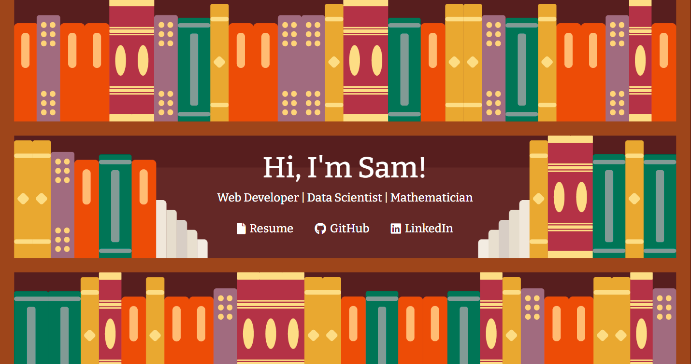

<!--
**CapSnCrunch/capsncrunch** is a ✨ _special_ ✨ repository because its `README.md` (this file) appears on your GitHub profile.

Here are some ideas to get you started:

- 🔭 I’m currently working on ...
- 🌱 I’m currently learning ...
- 👯 I’m looking to collaborate on ...
- 🤔 I’m looking for help with ...
- 💬 Ask me about ...
- 📫 How to reach me: ...
- 😄 Pronouns: ...
- ⚡ Fun fact: ...
-->

# Welcome to my GitHub Profile!

## What I'm currently working on
- Applying to Junior Software Engineering positions
- Writing articles for my blog
- <a href='https://sites.cns.utexas.edu/geometry_lab/home'>Computational Representation Theory Research with TXGL</a>

## What I'm currently learning
- <a href = 'https://www.djangoproject.com/>Django</a>
- Adobe Illustrator
